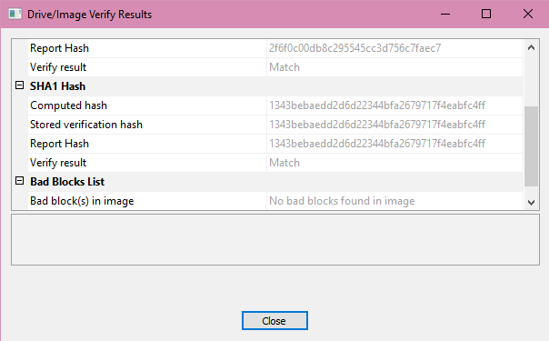
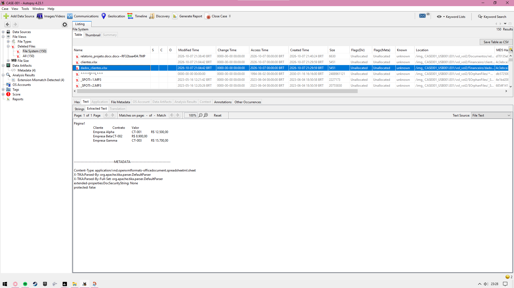
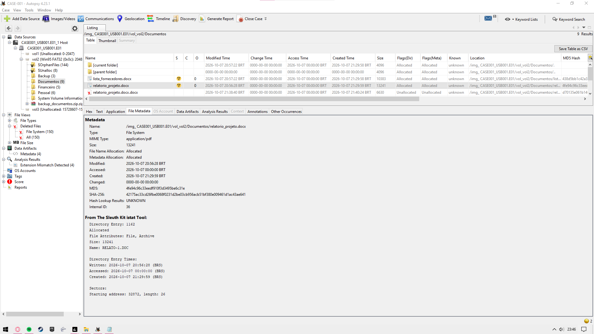
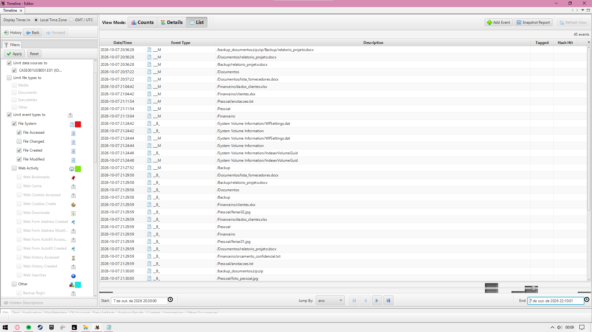
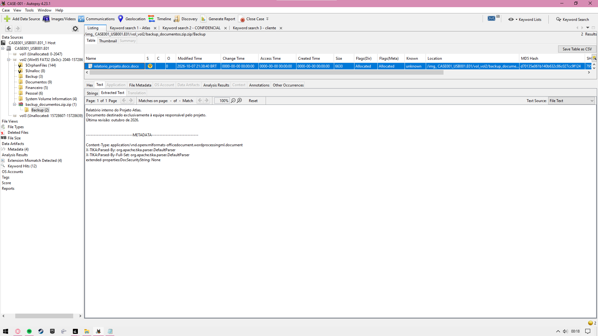

# Digital Forensics Investigation - CASE-001

Practical digital forensics laboratory using a USB device in a controlled environment with fictitious data.

> **Scope:** educational and portfolio project using fictitious data created specifically for this lab. No real corporate or personal data was used.

## Objective
Acquire, preserve, verify, analyze and document digital evidence from a USB storage device.

## Tools
- **FTK Imager**
- **Autopsy 4.23.1**

## Techniques demonstrated
- E01 forensic imaging
- MD5 and SHA-1 integrity verification
- Chain of custody
- Deleted file recovery
- FAT file system analysis
- Metadata analysis
- Extension mismatch detection
- Keyword search
- ZIP / embedded content analysis
- Timeline reconstruction
- Technical forensic reporting

## Evidence integrity
- **MD5:** `2f6f0c00db8c295545cc3d756c7faec7`
- **SHA-1:** `1343bebaedd2d6d22344bfa2679717f4eabfc4ff`
- **Verification:** `Match`
- **Bad blocks:** none detected

## Main findings
1. Deleted spreadsheet `dados_clientes.xlsx` recovered from unallocated space.
2. Confidential financial document `orcamento_confidencial.txt` identified in allocated space.
3. Extension mismatch detected in `relatorio_projeto.docx`, whose MIME type was identified as PDF.
4. Deleted project document remained recoverable from unallocated space.
5. Relevant project document identified inside a ZIP archive.

## Keyword search
Search terms included:
- `Atlas`
- `CONFIDENCIAL`
- `cliente`

## Timeline analysis
Autopsy Timeline was used to correlate file creation and modification events from 07/10/2026.

## Workflow
`Acquire -> Preserve -> Verify -> Analyze -> Correlate -> Report`

## Selected evidence










## Full technical report
[Relatorio_Tecnico_Forense_CASE001.pdf](report/Relatorio_Tecnico_Forense_CASE001.pdf)

## Repository structure
```text
dfir-lab-case-001/
├── README.md
├── report/
│   └── Relatorio_Tecnico_Forense_CASE001.pdf
├── documentation/
│   └── Cadeia_de_Custodia_CASE001.txt
└── screenshots/
    ├── 01_ftk_hash_verification.png
    ├── 02_deleted_file_recovery.png
    ├── 03_deleted_file_metadata.png
    ├── 04_confidential_file_content.png
    ├── 05_extension_mismatch_metadata.png
    ├── 06_deleted_document_recovery.png
    ├── 07_timeline_analysis_part1.png
    ├── 08_timeline_analysis_part2.png
    └── 09_zip_embedded_file_content.png
```

## What this project demonstrates
This project demonstrates hands-on familiarity with a basic digital-forensics workflow for junior DFIR, incident-response, and cybersecurity roles.
